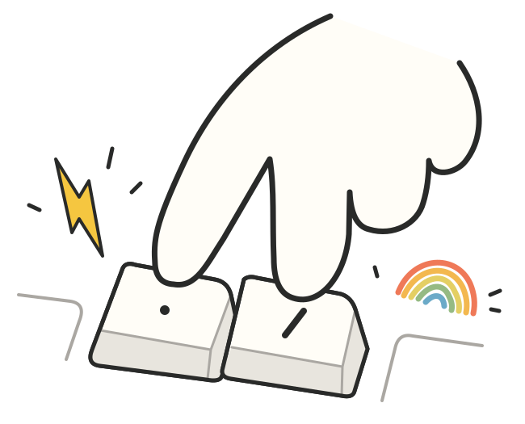

# 닷 스킬

<p align="left">
  
</p>

**내가 쓰려고 만든 스킬들.**

스킬이 많아지니 내 거 찾기가 어려워서 이름 앞에 `.`을 붙였다.

데일리한 건 번개 `⚡`, 깊게 들어가는 건 무지개 `🌈`.
한눈에 골라 쓰려고 붙인 표시다.

## Accepted Skills

### ⚡ 데일리한 거

- `.⚡good` — [동작은 그대로, 코드랑 주석 정리](skills/데일리함/good/README.md)
- `.⚡wow` — [더 단순하게 설계해보기](skills/데일리함/wow/README.md)
- `.⚡commit` — [변경 나눠서 한글로 커밋](skills/데일리함/commit/README.md)
- `.⚡review` — [사람이 결정할 질문만 추리기](skills/데일리함/review/README.md)
- `.⚡ship` — [커밋하고 PR·MR 제목이랑 본문 준비](skills/데일리함/ship/README.md)

### 🌈 깊게 들어가는 거

- `.🌈orbit` — [레포 점검하고 기술 이슈 발행](skills/살짝무거움/orbit/README.md)
- `.🌈code-to-figma` — [웹 화면을 피그마로 옮겨서 편집하기](skills/살짝무거움/code-to-figma/README.md)
- `.🌈soul-extractor` — [내 말투 뽑아서 글 쓰기](skills/살짝무거움/soul-extractor/README.md)

## 설치

```bash
gh repo clone qpwoei0123/skills
cd skills
python3 scripts/deploy_skills.py
```

이렇게 하면 `~/.agents/skills`에 들어간다.

## 써보기

스킬 고르고 할 일 적으면 된다.

```text
$.⚡good 이거 좀 다듬어줘
$.⚡ship 커밋 잘 나누고 Draft PR로 올려줘
```

[스킬 만들 때](docs/SKILL-STANDARD.md) · [예전 이름 쓰고 있다면](docs/MIGRATION.md)
